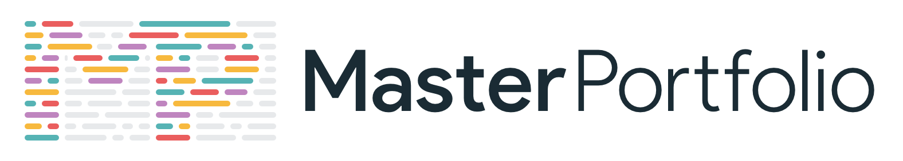
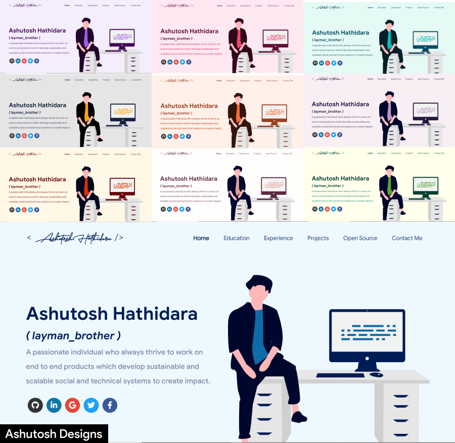

<p align="center"> 
    </img>
</p>

<h1 align="center"> Software Developer Master Portfolio 🔥 </h1> 
<h3 align="center"> A clean, beautiful, responsive, and 100% customizable portfolio <br /> template for Software Developers! </h3>

<p align="center">
  <a href="http://hits.dwyl.com/ashutosh1919/masterPortfolio"></a>
  <a href="https://nodejs.org/en/blog/release/v12.13.0/"></a>
  <a href="https://www.npmjs.com/package/npm/v/6.13.4"></a>
  <a href="https://reactjs.org/"></a>
  <a href="https://join.slack.com/t/masterportfolio/shared_invite/zt-g772n1fo-Ns4usanURF8jVb8wk2lRAA"></a>
  <a href="https://github.com/prettier/prettier"></a>
  <br/>
  <a href="https://app.netlify.com/sites/ashutosh1919portfolio/deploys"></a>
  <a href="https://travis-ci.org/badges/badgerbadgerbadger"></a>
  <a href="http://badges.mit-license.org/"></a>
  <a href="https://github.com/ashutosh1919/masterPortfolio/commits/master"></a>
  <a href="http://badges.mit-license.org/"></a>
  <a href="https://ashutoshhathidara.com/"></a>
  <a href="https://img.shields.io/badge/price-free-ff69b4"></a>
</p>
<p align="center">If you want to discuss about something, you can ask on my <a href="https://discord.com/invite/GkcbM5bwZr">Discord Server</a>.</p>

<p align="center"> 
    <a href="https://ashutosh1919.github.io" target="_blank">
    </img>
  </a>
</p>

:star: Star us on GitHub — it helps!

# Sections 📚

✔️ Summary and About me\
✔️ Skills \
✔️ Open Source Projects Connected with Github\
✔️ Experience\
✔️ Certifications 🏆\
✔️ Blogs\
✔️ Education\
✔️ Contact me

To view a live example, **[click here](https://ashutosh1919.github.io/)**

# Clone and Use 📋

- The website is completely built on `react-js` library of `javascript` and that's why we need `nodejs` and `npm` installed
- While installing `nodejs` and `npm`, try to install versions which are equal or greater than the versions mentioned in badges above
- In case you want to help developing it or simply saving it, you can fork the repository just by clicking the button on the top-right corner of this page
- After the successful installation of `nodejs` and `npm`, clone the repository into your local system using below command:
  ```bash
   git clone https://github.com/ashutosh1919/masterPortfolio.git
  ```
  This will clone the whole repository in your system.
- To download required dependencies to your system, navigate to the directory where the cloned repository resides and execute following command:
  ```node
  npm install
  ```
- Now the project is ready to use
- You can check it using `npm start`, it will open the website locally on your browser.

# Customize it to make your own portfolio ✏️

In this project, there are basically 4 things that you need to change to customize this to anyone else's portfolio: **package.json**, **Personal Information**, **Github Information** and **Splash Logo**.

### package.json

Open this file, which is in the main cloned directory, choose any "name" and change "homepage " to `https://<your-github-username>.github.io`. Do not forget the `https://`, otherwise fonts will not load.

### Personal Information

You will find `src/portfolio.js` file which contains the complete information about the user. The file looks something like below:

```javascript
// Home Page
const greeting = {
    ...
}

// Social Media
const socialMediaLinks = {
    ...
}

...
```

You can change the personal information, experience, education, social media, certifications, blog information, contact information etc. in `src/portfolio.js` to directly reflect them in portfolio website.

### How to change the icons on homepage under what i do section?

1. This section pulls data from `skills` in portfolio.js file.
2. Visit this website: https://icon-sets.iconify.design/
3. Search for the skill you are looking to add.
4. Select the icon of your choice.
5. Copy the text beside **Selected Icon** and replace it with `fontAwesomeClassName` of that particular softwareSkill.

#### How to use custom images instead of Iconify Icons?

1. Add a valid image file into the `public/skills` folder
2. Insert the image name into the `imageSrc` attribute of the particular softwareSkill
3. Remove the `fontAwesomeClassName` property or leave it empty because it takes precedence over `imageSrc`
4. Add custom styling to the `img` using the `style` Property

### Github Information

You will find `git_data_fetcher.mjs` file in the main directory of the repository. This file is used to fetch the data (Pull requests, Issues, Organizations, Pinned projects etc.) from your github.

In the project you will see a `env.example` file, create a new file named `.env` and copy contents of `env.example` into it. In that file, you will see the following environment variables

```javascript
GITHUB_TOKEN = your_token;
GITHUB_USERNAME = your_username;
```

You can get a github token as described [here](https://docs.github.com/en/github/authenticating-to-github/creating-a-personal-access-token). Give all permissions while generating token. Add your github username and the token generated in `GITHUB_USERNAME` and `GITHUB_TOKEN` variables in the .env file.

Now, you need to run following command. (Make sure you executed `npm install` before this)

**Warning:** Treat your tokens like passwords and keep them secret. When working with the API, use tokens as environment variables instead of hardcoding them into your programs.

```node
node git_data_fetcher.mjs
```

This will fetch all the data from your github and it will automatically replace my data with yours.
Whenever you want to update the github related information on the website you need to run this command.

### Splash Logo

Note here that if you click [my portfolio](https://ashutosh1919.github.io), you can see animating the logo at the beginning. I have designed that logo in [`Figma`](https://www.figma.com/) and then animated it using css.
Therefore, this part of portfolio is not customizable. But don't worry we have a solution to this problem. You have below two alternatives:

- If you want to design your own logo, then you can design it using `Figma` or `Adobe XD` or `Adobe Illustrator` or `Inkscape`. If you want to animate it, you can refer to `./src/components/Loader` directory which contains `js` and `css` files which animates the logo
- If you don't want Splash screen or you don't know how to design logo, then this option is for you

  - You can open `src/portfolio.js` file and at the top of this file you will see `settings` component as below:
    ```javascript
    // Website related settings
    const settings = {
      isSplash: true,
    };
    ```
  - Change `isSplash` from `true` to `false`
  - Now, if you see your website using `npm start`, it will directly open `home` rather than animating logo `splash` screen
  - If you design your logo in future, then edit the files in `./src/components/Loader` and then revert `isSplash` to `true` in `src/portfolio.js`.

## Other

- You need to change the website title and other descriptions in `public/index.html`
- You can define your own favicon in `public/icons` directory. If you don't have a favicon, you can generate favicons from [Favicon Generator](https://www.favicon-generator.org/) and [Favicon IO](https://favicon.io/)
- You can also edit your website preview (known as description image). Run your site locally, take a screenshot and replace with `public/icons/desc.png`. Note that your screenshot should be 1280x640 for better preview.

# Choose Theme 🌈

- You can take a look at `src/theme.js` file where all available themes are mentioned with their respective color codes
- At the bottom of this file you will see the below code:
  - `export const chosenTheme = blueTheme;`
  - You need to change the name from `blueTheme` to whatever theme you want to set your website to
  - You can define new theme similarly as other themes and you can assign name of that new defined theme to `chosenTheme`
- That's it. You just need to change the theme name and the code will take care of everything else
- Run `npm start` to check if everything is ok.

# Deployment 📦

- Once you are done with your setup and have successfully completed all steps above, you need to put your website online!
- I highly recommend using [Github Pages](https://create-react-app.dev/docs/deployment/#github-pages) to achieve this the EASIEST WAY.
- To deploy your website, you have two options. First you need to create a github repository with the name `<your-github-username>.github.io`. Please don't give it any other name.
- Now, you need to generate a production build and deploy the website.

**Option 1:**

- Run `npm run build` to generate the production build folder.
- Enter the build folder, `git init` and push the generated code to the `master` branch of your new repository on github. That's it. It's Done.
- You may need to `git init` and force push at every new build.

**Option 2 (will not work with [user pages](https://docs.github.com/en/github/working-with-github-pages/about-github-pages)):**

- Run `npm run deploy` to build and create a branch called `gh-pages`. It will push the `build` files to that branch.
- The last step in deploying is to enable `Github Pages` in settings of the repository and select `gh-pages` branch.

Now, your website is successfully deployed and you can visit it at `<your-github-username>.github.io`.  
If you are stuck somewhere and want to observe the deployment process in depth, then please watch below video.

<p align="center"> 
    <a href="http://www.youtube.com/watch?v=IwBS39TOmpA" target="_blank">
    </img>
  </a>
</p>

# Technologies used 🛠️

- [React](https://reactjs.org/)
- [graphql](https://graphql.org/)
- [apollo-boost](https://www.apollographql.com/docs/react/get-started/)
- [baseui](https://github.com/uber/baseweb)
- [react-reveal](https://www.react-reveal.com/)
- [styled-components](https://styled-components.com/)

# illustrations 🍥

- [UnDraw](https://undraw.co/illustrations)

# License 📄

This project is licensed under the MIT License - see the [LICENSE.md](./LICENSE) file for details.

# Contributing 💡

If you can help us with these. Please don't hesitate to open an [pull request](https://github.com/ashutosh1919/masterPortfolio/pulls) or [issue](https://github.com/ashutosh1919/masterPortfolio/issues).

- Move to Gatsby
- Add Podcast Section and Video Section
- Add tests to automate review.
- Setup Travis workflow.

# Contributors ✨

<!-- ALL-CONTRIBUTORS-LIST:START - Do not remove or modify this section -->
<!-- prettier-ignore-start -->
<!-- markdownlint-disable -->
<table>
  <tbody>
    <tr>
      <td align="center" valign="top" width="14.28%"><a href="http://ashutosh1919.github.io"><br /><sub><b>Ashutosh Hathidara</b></sub></a><br /><a href="https://github.com/ashutosh1919/masterPortfolio/commits?author=ashutosh1919" title="Code">💻</a> <a href="https://github.com/ashutosh1919/masterPortfolio/commits?author=ashutosh1919" title="Documentation">📖</a> <a href="#design-ashutosh1919" title="Design">🎨</a> <a href="#maintenance-ashutosh1919" title="Maintenance">🚧</a> <a href="#ideas-ashutosh1919" title="Ideas, Planning, & Feedback">🤔</a></td>
      <td align="center" valign="top" width="14.28%"><a href="https://danielmarostica.github.io/"><br /><sub><b>Daniel Marostica</b></sub></a><br /><a href="https://github.com/ashutosh1919/masterPortfolio/commits?author=danielmarostica" title="Documentation">📖</a> <a href="#design-danielmarostica" title="Design">🎨</a></td>
      <td align="center" valign="top" width="14.28%"><a href="https://dineshnadimpalli.com"><br /><sub><b>Dinesh Nadimpalli</b></sub></a><br /><a href="https://github.com/ashutosh1919/masterPortfolio/commits?author=dineshnadimpalli" title="Code">💻</a></td>
      <td align="center" valign="top" width="14.28%"><a href="http://jivthesh.github.io"><br /><sub><b>Jivthesh M R</b></sub></a><br /><a href="https://github.com/ashutosh1919/masterPortfolio/commits?author=jivthesh" title="Documentation">📖</a></td>
      <td align="center" valign="top" width="14.28%"><a href="http://jatinchauhan.tech"><br /><sub><b>Jatin Chauhan</b></sub></a><br /><a href="https://github.com/ashutosh1919/masterPortfolio/commits?author=mrjatinchauhan" title="Code">💻</a></td>
      <td align="center" valign="top" width="14.28%"><a href="https://th3c0d3br34ker.github.io/"><br /><sub><b>Jainam Desai</b></sub></a><br /><a href="https://github.com/ashutosh1919/masterPortfolio/commits?author=th3c0d3br34ker" title="Code">💻</a> <a href="#question-th3c0d3br34ker" title="Answering Questions">💬</a></td>
      <td align="center" valign="top" width="14.28%"><a href="https://miftaulmannan.wordpress.com/"><br /><sub><b>Miftaul Mannan</b></sub></a><br /><a href="https://github.com/ashutosh1919/masterPortfolio/commits?author=Tasin5541" title="Code">💻</a></td>
    </tr>
    <tr>
      <td align="center" valign="top" width="14.28%"><a href="http://a-mishra.github.io"><br /><sub><b>Ashutosh Mishra</b></sub></a><br /><a href="https://github.com/ashutosh1919/masterPortfolio/commits?author=a-mishra" title="Code">💻</a></td>
      <td align="center" valign="top" width="14.28%"><a href="http://tamojit.wixsite.com/mrtamojit"><br /><sub><b>Tamojit</b></sub></a><br /><a href="https://github.com/ashutosh1919/masterPortfolio/commits?author=tamojit-123" title="Documentation">📖</a> <a href="https://github.com/ashutosh1919/masterPortfolio/commits?author=tamojit-123" title="Code">💻</a> <a href="#design-tamojit-123" title="Design">🎨</a></td>
      <td align="center" valign="top" width="14.28%"><a href="https://prabin-karki.com.np"><br /><sub><b>Prabin Karki</b></sub></a><br /><a href="https://github.com/ashutosh1919/masterPortfolio/commits?author=githubprabin143" title="Code">💻</a></td>
      <td align="center" valign="top" width="14.28%"><a href="https://praveen.science/"><br /><sub><b>Praveen Kumar Purushothaman</b></sub></a><br /><a href="https://github.com/ashutosh1919/masterPortfolio/commits?author=praveenscience" title="Documentation">📖</a></td>
      <td align="center" valign="top" width="14.28%"><a href="http://baul.ml"><br /><sub><b>paul</b></sub></a><br /><a href="https://github.com/ashutosh1919/masterPortfolio/commits?author=baulml" title="Code">💻</a></td>
      <td align="center" valign="top" width="14.28%"><a href="https://github.com/SandipDhang"><br /><sub><b>Sandip Dhang</b></sub></a><br /><a href="https://github.com/ashutosh1919/masterPortfolio/commits?author=SandipDhang" title="Code">💻</a></td>
      <td align="center" valign="top" width="14.28%"><a href="https://github.com/ioribrn"><br /><sub><b>Jawad Moustadif</b></sub></a><br /><a href="https://github.com/ashutosh1919/masterPortfolio/commits?author=ioribrn" title="Code">💻</a></td>
    </tr>
    <tr>
      <td align="center" valign="top" width="14.28%"><a href="https://github.com/priyanshk20"><br /><sub><b>Priyansh Khandelwal</b></sub></a><br /><a href="https://github.com/ashutosh1919/masterPortfolio/commits?author=priyanshk20" title="Code">💻</a> <a href="#design-priyanshk20" title="Design">🎨</a></td>
      <td align="center" valign="top" width="14.28%"><a href="https://github.com/abdslam01"><br /><sub><b>Abdessalam Bahafid</b></sub></a><br /><a href="https://github.com/ashutosh1919/masterPortfolio/commits?author=abdslam01" title="Code">💻</a></td>
      <td align="center" valign="top" width="14.28%"><a href="https://dhruvkrishnavaid.github.io"><br /><sub><b>Dhruv Krishna Vaid</b></sub></a><br /><a href="https://github.com/ashutosh1919/masterPortfolio/commits?author=dhruvkrishnavaid" title="Code">💻</a> <a href="https://github.com/ashutosh1919/masterPortfolio/commits?author=dhruvkrishnavaid" title="Documentation">📖</a> <a href="#ideas-dhruvkrishnavaid" title="Ideas, Planning, & Feedback">🤔</a> <a href="#question-dhruvkrishnavaid" title="Answering Questions">💬</a></td>
      <td align="center" valign="top" width="14.28%"><a href="https://kasroudra.github.io"><br /><sub><b>KasRoudra</b></sub></a><br /><a href="https://github.com/ashutosh1919/masterPortfolio/commits?author=KasRoudra" title="Code">💻</a></td>
      <td align="center" valign="top" width="14.28%"><a href="https://telegram.dog/AlbertEinstein_TG"><br /><sub><b>Albert Einstein</b></sub></a><br /><a href="https://github.com/ashutosh1919/masterPortfolio/commits?author=AlbertEinsteinTG" title="Documentation">📖</a></td>
      <td align="center" valign="top" width="14.28%"><a href="https://github.com/SurajPratap10"><br /><sub><b>Suraj Pratap</b></sub></a><br /><a href="https://github.com/ashutosh1919/masterPortfolio/commits?author=SurajPratap10" title="Documentation">📖</a></td>
      <td align="center" valign="top" width="14.28%"><a href="https://lightmap.dev"><br /><sub><b>Sai Teja</b></sub></a><br /><a href="https://github.com/ashutosh1919/masterPortfolio/commits?author=saiteja13427" title="Code">💻</a> <a href="https://github.com/ashutosh1919/masterPortfolio/commits?author=saiteja13427" title="Documentation">📖</a> <a href="#maintenance-saiteja13427" title="Maintenance">🚧</a> <a href="#ideas-saiteja13427" title="Ideas, Planning, & Feedback">🤔</a></td>
    </tr>
    <tr>
      <td align="center" valign="top" width="14.28%"><a href="https://anirudhpanda.in/"><br /><sub><b>Anirudh Panda</b></sub></a><br /><a href="https://github.com/ashutosh1919/masterPortfolio/commits?author=AnirudhPanda" title="Code">💻</a></td>
      <td align="center" valign="top" width="14.28%"><a href="https://hidayat7z.github.io"><br /><sub><b>Md Hidayat Rasool</b></sub></a><br /><a href="https://github.com/ashutosh1919/masterPortfolio/commits?author=hidayat7z" title="Documentation">📖</a></td>
      <td align="center" valign="top" width="14.28%"><a href="https://www.linkedin.com/in/siddhantsadangi/"><br /><sub><b>Siddhant Sadangi</b></sub></a><br /><a href="https://github.com/ashutosh1919/masterPortfolio/commits?author=SiddhantSadangi" title="Documentation">📖</a></td>
      <td align="center" valign="top" width="14.28%"><a href="https://anoopvarghese.in/"><br /><sub><b>Anoop V</b></sub></a><br /><a href="https://github.com/ashutosh1919/masterPortfolio/commits?author=vanoop729" title="Code">💻</a></td>
      <td align="center" valign="top" width="14.28%"><a href="https://github.com/aash1999"><br /><sub><b>Aakash Singh</b></sub></a><br /><a href="https://github.com/ashutosh1919/masterPortfolio/commits?author=aash1999" title="Code">💻</a></td>
      <td align="center" valign="top" width="14.28%"><a href="https://aherrera3.github.io/"><br /><sub><b>Angélica Herrera Alba</b></sub></a><br /><a href="https://github.com/ashutosh1919/masterPortfolio/commits?author=aherrera3" title="Code">💻</a></td>
      <td align="center" valign="top" width="14.28%"><a href="https://davidminkovski.com"><br /><sub><b>David Minkovski</b></sub></a><br /><a href="#ideas-dminkovski" title="Ideas, Planning, & Feedback">🤔</a> <a href="https://github.com/ashutosh1919/masterPortfolio/commits?author=dminkovski" title="Code">💻</a></td>
    </tr>
    <tr>
      <td align="center" valign="top" width="14.28%"><a href="http://cdigruttola.it"><br /><sub><b>Carmine Di Gruttola</b></sub></a><br /><a href="#ideas-cdigruttola" title="Ideas, Planning, & Feedback">🤔</a> <a href="#promotion-cdigruttola" title="Promotion">📣</a></td>
      <td align="center" valign="top" width="14.28%"><a href="https://github.com/Vyomrana02"><br /><sub><b>Vyom Rana</b></sub></a><br /><a href="https://github.com/ashutosh1919/masterPortfolio/commits?author=Vyomrana02" title="Code">💻</a></td>
    </tr>
  </tbody>
</table>

<!-- markdownlint-restore -->
<!-- prettier-ignore-end -->

<!-- ALL-CONTRIBUTORS-LIST:END -->

# References 👏🏻

- Some Design and Implementation Ideas are taken from [Saad Pasta's Portfolio Project](https://github.com/saadpasta/developerFolio).
- The Logo of MasterPortfolio is inspired from [prettier-logo](https://github.com/prettier/prettier-logo) for [prettier](https://github.com/prettier/prettier) designed by @ianstormtaylor.
